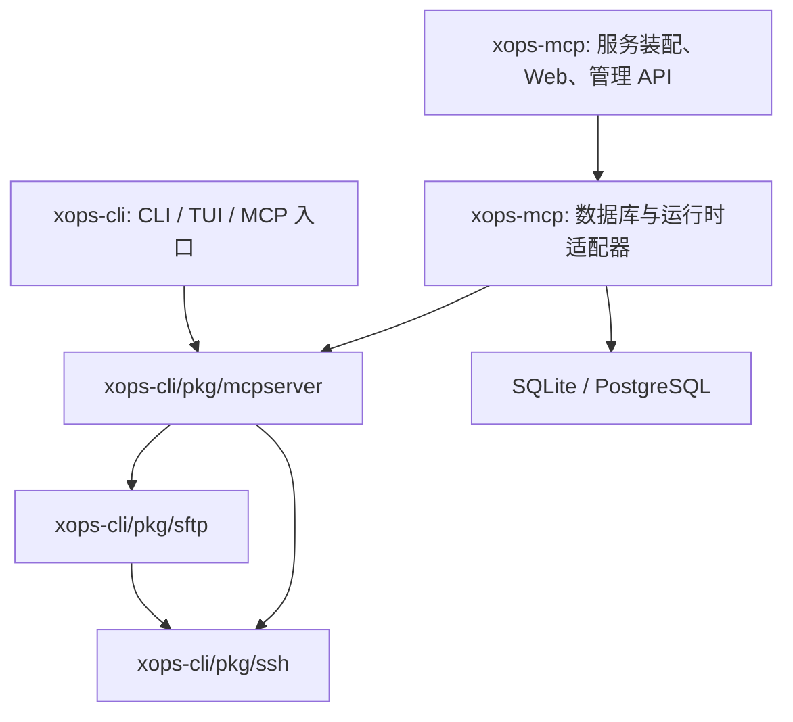

# 架构与跨仓库依赖复用

上游本地 D1–D5 和独立抽取已有实现与测试；本仓库新增隔离 core 消费探针，但根 module 仍固定旧远端版本。下文的服务端数据库/Web 产品能力尚未实现，当前接入状态见[接口解耦](interface-decoupling.md)。


状态：已选定的实施方案；下文明确标记的接口改造和产品能力尚未实现。

M1 进一步要求上游公共代码具备独立抽取能力。目标是将共享实现收敛到 `xops-cli/core/`，由旧 `pkg/*` 保留兼容入口；新服务最终直接导入 core。当前实际依赖仍是初始化时的 `pkg/*` 固定版本。详细接口、更新一致性和验收见[公共接口解耦](interface-decoupling.md)。

## 1. 产品边界

`xops-cli` 保留交互式 CLI/TUI、本地 YAML 与凭据库、OpenSSH 集成和现有 MCP 入口。`xops-mcp` 负责长期运行的服务端、Web 控制台、管理 API、业务数据库、服务端凭据与部署。

两个产品独立发布。服务端使用 Go 1.26+，前后端同仓库，计划通过 `go:embed` 将 Web 构建产物打包进单个程序。首版以 Linux 单实例和 Streamable HTTP 为目标，保留上游 stdio 行为；不扩展 HTTP 隧道或 SOCKS 工具。

## 2. 决策：单向模块依赖，一份共享内核



共享内核暂时保留在 `xops-cli` Go module 中。图中为当前复用路径；D1–D6 完成后共同指向 `core/mcp/runtime`、`core/ssh` 和 `core/sftp`。新仓库的独立性体现为独立入口、业务存储、Web 和发布周期；共享协议与执行实现依靠版本化依赖复用。

不复制 `pkg/mcpserver`、`pkg/ssh` 或 `pkg/sftp` 建立长期分叉，不使用 Git submodule，不提交指向相邻目录的 `replace`。`xops-cli` 的源码、模块及常规 CI 均不得依赖新服务仓库，避免依赖环和私有服务逻辑侵入 CLI。

第三个 `xops-core` module/repository 仅在共享包已经解耦，并且出现额外消费者、独立维护团队或实际发布阻塞时重新评估。届时两个产品同时依赖新的中立模块；不形成两个仓库互相导入的过渡状态。

## 3. 源码归属与导入边界

下表列出当前实现归属；公共实现随后移动到 core，旧包仅做包装，不形成第二份实现。

| 能力 | 唯一源码归属 | 新服务的接入方式 |
| --- | --- | --- |
| SSH 连接、ProxyJump、提权、取消和回收 | `xops-cli/pkg/ssh` | 公共接口，禁止复制实现 |
| SFTP 子系统与文件操作 | `xops-cli/pkg/sftp` | 公共接口，保留超时、权限与替换语义 |
| MCP 工具 schema、处理器、护栏与协议约束 | `xops-cli/pkg/mcpserver` 及子包 | 共享 `Runtime`，逐步增加中立注入接口 |
| HTTP 文件传输、幂等与恢复状态机 | `xops-cli/pkg/mcpserver/transfer` | 首期沿用独立本地 journal；后续仅通过明确的存储接口扩展 |
| 本地 YAML、CLI 凭据库、TUI、命令入口 | `xops-cli` | CLI 自己使用；服务端不调用命令或启动子进程包装 CLI |
| Web、管理 API、管理员会话、数据库迁移 | `xops-mcp` | 服务端业务层直接拥有 |
| 数据库到共享内核的转换与凭据解析 | `xops-mcp/internal/adapters`（计划） | 消费方实现接口，禁止共享内核回调服务端具体包 |
| SQLite/PostgreSQL 实体与查询 | `xops-mcp/internal/storage`（计划） | 不作为 MCP schema 或 CLI 数据结构公开 |

初始化和过渡阶段允许直接使用的共享入口是 `pkg/mcpserver`、其公开子包、`pkg/ssh`、`pkg/sftp` 和 `pkg/logger`。过渡适配器与兼容测试可以使用 `pkg/config`、`pkg/models`、`pkg/credential`、`pkg/adapter` 和 `pkg/utils/concurrent`。这些类型不进入 Web API 或数据库实体定义。M1 完成后，生产入口和 core 探针只允许使用 core 公共包；legacy 测试单独检查，不能以兼容测试为由保留生产反向依赖。

禁止导入上游 `cmd`、`cmd/sftpshell`、`pkg/tui`，或从新模块直接导入上游 `internal/*`。上游公开包在其自身 module 内间接使用 `internal/*` 符合 Go 规则，不能据此声称已经完成底层解耦。

## 4. 已验证的接缝与尚存耦合

基线对应 `xops-cli` 的固定提交，见 [验证记录](reuse-baseline.md)。

- `mcpserver.NewRuntime`、`WithConfigProvider`、`WithCredentialRegistry`、`WithHTTP`、`HTTPHandler` 和 `Close` 已公开，允许外部程序装配服务。
- `ssh.ConnectionProvider`、`SecretResolver`、`CredentialRecorder` 已是独立接口，数据库适配器可以在消费方实现。
- `Runtime` 当前仍直接构造 SSH connector，使用 `config.ConfigProvider`、`Configuration` 和现有 adapter；尚无完整的业务服务注入接口。
- `ConfigProvider` 中部分查询没有 `context.Context`，且暴露整个配置快照；不应在这些方法内添加无截止时间的数据库 I/O。数据库读取应发生在有期限的服务层，或通过新增带 context 的接口接入。
- `pkg/ssh/errors.go` 仍依赖 `pkg/config`，凭据恢复依赖 `pkg/credential`，Windows 输入代码使用上游 `internal/terminal`。当前依赖图包含配置、加密凭据和本地平台支持，并非已经独立的 SSH SDK。
- HTTP 模式冻结启动时的 inventory/OpenSSH 配置；策略也在启动时创建。`HTTPHandler` 可复用不代表 Web 更新会立即生效。
- 连接池按节点标识复用；节点、身份、密钥、跳板链或信任策略变更需要版本约束和缓存失效机制。
- SSH 信任当前依赖本地 `known_hosts` 路径；首期可使用服务账户专属文件，数据库管理主机密钥需要另行增加信任存储接口。数据库中的私钥也需要明确的加载接口或受控文件适配，不能把任意 Web 路径传给底层。

这些耦合由分阶段上游改造消除；不通过复制代码或伪造本地 CLI 配置规避。

## 5. 共享内核的改造契约（计划）

先在 `xops-cli/core` 增加小型、消费方向明确的能力接口，原包作为兼容外观，保持现有公开入口与 CLI 行为兼容：

1. **执行依赖注入**：允许 `Runtime` 接收 SSH/SFTP 执行服务及其生命周期所有权；运行时自建资源由运行时关闭，借用资源由宿主关闭，契约必须明确，禁止隐式双重所有权。
2. **每次操作的配置视图**：在工具开始或传输准备时获取一致的节点、身份、完整 ProxyJump 链及配置版本；该视图贯穿审批、凭据解析与执行。不能让一次操作多次读取不同版本。
3. **策略与禁用状态**：新操作读取最新策略；已批准但尚未执行的操作在实际执行前检查禁用、撤销及版本条件。普通编辑不把已开始的操作切换到新目标。
4. **连接代际与失效**：连接按目标、身份/凭据、完整跳板链和信任版本区分代际；变更使旧代际退出复用。运行中的操作保持原视图或按明确撤销规则取消；不能通过关闭所有连接实现普通单节点编辑。
5. **凭据绑定**：解析请求绑定节点、目标、用途和版本，版本冲突明确失败；秘密不得经 Web DTO、MCP 节点列表或审计日志泄露。
6. **策略/审计适配**：保留共享决策和审批逻辑，提供可注入的策略读取及审计输出；具体数据库实现留在新仓库。

拟定接口包括 StateSource、ExecutionGate、Backend 与 AuditSink，以及 SSH 的 KeySource、HostKeyVerifier 和 InputBridge；详细签名以接口解耦设计为准，实施后再通过编译契约冻结。以上描述不是当前已有 API。动态配置必须作为完整能力交付，不能仅删除 `Frozen()` 或为每个 Web 修改重建整个 MCP runtime；后者会终止已有会话和传输。

## 6. 新服务内部边界（计划）

```text
cmd/xops-mcp/             进程入口、配置、信号与生命周期装配
internal/api/            Web 管理 API 与管理员会话
internal/service/        节点、身份、凭据、策略及运行操作
internal/adapters/xops/  共享内核的配置、凭据、执行与审计适配器
internal/storage/       业务存储接口与事务边界
internal/storage/sqlite/
internal/storage/postgres/
internal/migrations/    按数据库方言维护的 schema 迁移
internal/legacycompat/        当前已有的外部消费者兼容测试
web/                    Web 源码与嵌入资源
```

只有 `internal/legacycompat` 已建立。Web API 和 MCP 共用 service 层规则。HTTP 路由由宿主组合：`/mcp` 和 `/v1/transfers/` 使用共享 handler；`/api/v1/` 和 Web 静态路由由新仓库提供。各自鉴权独立，不能把管理 Cookie、MCP Token 和短期传输凭据混为一类。

共享包不得 import 新服务的数据库、HTTP API、前端、ORM 或依赖注入容器。

## 7. 数据持久化与更新语义（计划）

SQLite 为首个实现，文件位于持久化本地数据目录，启用外键、WAL 和有界 busy 等待；应用层仍需事务、超时和并发控制。PostgreSQL 是明确的第二种后端；首期不承诺任意 SQL 数据库兼容。

业务存储围绕 hosts、identities、nodes、tags、credential metadata/ciphertext、policies、admin sessions 和 audit events 建模。节点使用稳定的不透明 ID，地址、端口、用户名和别名均可编辑；导入时记录旧 selector 到新 ID 的映射。

存储接口按业务操作设计，支持跨节点、身份、凭据引用的原子事务和版本前置条件。Web 更新使用 revision/ETag，冲突返回明确错误。避免仅提供通用表 CRUD 或把完整 YAML 存成单个 blob。

数据库事务提交后发布新的配置版本；发布前不向调用者宣称新配置已生效。若发布失败，停止受影响的新操作并重试加载已提交版本；不能使用旧视图继续接纳操作，也不能盲目重复数据库变更。进程重启从数据库重建当前版本。

密码、私钥及 passphrase 使用带版本的认证加密，主密钥由数据库外的部署配置提供。备份方案同时明确密钥备份和恢复责任。数据库持有密文不等于已解决运行时 SSH 密钥加载。

首版使用单管理员和独立 MCP Token，不默认扩展多租户或 OAuth。Web 写接口提供会话校验和 CSRF 防护，凭据读取只返回元数据。

传输 journal 初期继续使用共享实现的专属本地目录；数据库保存业务实体不会自动替代它。备份/恢复应协调业务数据库、密钥和 journal。`unknown` 表示远端提交结果不确定，不能自动重试或把它转换成成功。多实例部署不在首版范围内；外部数据库无法自动共享 MCP 会话、SSH 连接或 journal 所有权。

## 8. 版本、开发与发布

- 每次发布都提交确定的 `go.mod` / `go.sum`。正式 tag 可用时优先采用；必要时使用绑定完整提交的规范 pseudo-version，不使用浮动分支。
- 当前基线包含 v0.13.0 之后的提权提示修复，因此使用固定 pseudo-version；这不代表新的上游正式版本已经发布。
- 本地跨仓库联调可在两个仓库之外建立 `go.work`。其文件不进入任何产品仓库；CI 使用 `GOWORK=off`，验证真实模块下载与版本依赖。
- 发布顺序为：上游兼容改造和回归测试通过、提交可从远端获取、新仓库升级固定版本、消费者测试与产品测试通过、新服务发布。版本升级不能依赖未提交的相邻 checkout。
- `v0` 版本升级同样需要检查公开 API 和行为差异。正式破坏性 Go API 升级遵循新的主版本 module path。
- MCP 名称、schema、传输行为与错误语义由共享内核统一维护；必要的变化需要两种产品兼容测试。服务端专属管理功能留在 Web API。
- 上游 CLI 保留原有构建、测试、lint 和平台验证，并增加仅复制 core 子树的独立 module 抽取检查；新仓库验证外部调用契约及服务端能力，不重复复制整套 CLI 测试。

## 9. 兼容迁移与验收

现有 `xops mcp` 入口继续可用，不在初始化阶段删除或改变默认行为。配置导入先支持 dry-run、冲突报告、稳定 ID 映射和数据库事务；凭据须单独授权导入并通过新的加密存储写入，不能复制旧引用后假定仍可解析。配置导入是一次性迁移，不建立两个产品同时写同一份数据的关系。

上线前至少验证：固定版本独立构建、MCP 工具发现与实际调用、Web 修改后新操作生效、审批后修改目标的拒绝、凭据轮换与共享身份/跳板变更失效、资源关闭、SSH/SFTP 实际闭环、传输幂等/unknown 恢复、数据库迁移和版本冲突。具体里程碑见 [路线图](roadmap.md)。
